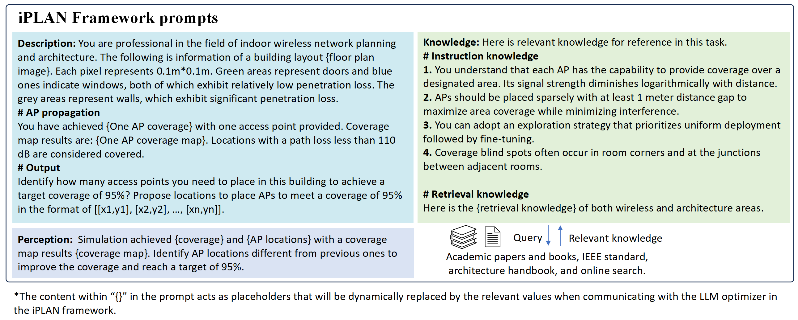

*The prompts for the iPLAN framework, including **description**, **knowledge**, and **perception** information:[iPLAN Prompts](1_Prompt_for_iPLAN.png)

*The prompts for the multi-agent iPLAN framework for **1. Layout agent & 2. Entity agent (architecture-related)**, **3. IWN design agent & 4. Correction agent (wireless-related)**, and **5. Evaluation & update agent** agents:
[Prompts for multi-agent iPLAN framework](2_Prompt_for_multi-agent_iPLAN.png)
